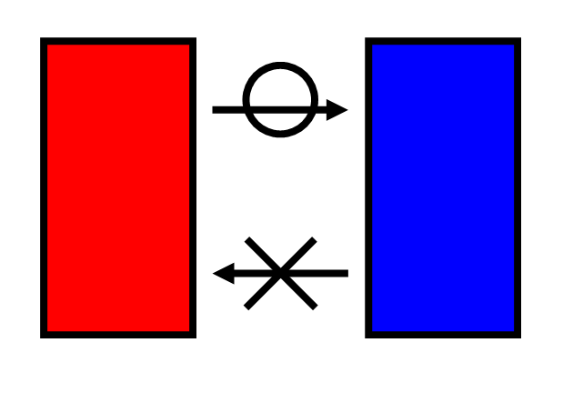

一個熱力學第二定律的例外，會改寫全世界的能源規則嗎？  
世界的能源規則的改寫，有可能逆轉全球暖化危機嗎？

在科學的世界裡，很少有定律像「熱力學第二定律」那樣被認為是不可動搖的真理。這條定律不只是用來說明熱機的效率限制，它還深深影響了我們對「時間」的理解。許多科學家甚至認為，時間之所以只能往前，就是因為熵（entropy）只能增加不能減少。

熵（entropy）這個看起來抽象的概念，其實說的就是「亂度」或「能量的分散程度」。熱力學第二定律的核心意思是：熱總是會從熱的地方流向冷的地方，而不會反過來由冷的地方流向熱的地方；系統的亂度只會增加，不會減少。

但也許這條定律有例外情況。如果我們能讓熱的散亂振動在沒有溫度差的情況下轉變為穩定的電能，甚至還能逆轉熵值的變化方向嗎？這會不會改寫我們對能源利用的基本理解，甚至需要對熱力學做修正？

這不是科幻小說的情節，而是一個我們研究團隊實驗中觀察到的現象。到目前為止，還沒有人能指出這個關於熱力學第二定律的例外的推論錯在哪裡？而我們也花了一年半的時間，嘗試將這個成果發表出去，卻總是卡在期刊找不到適合的審稿人。

化學期刊說這以電漿理論做的解釋屬於物理學，物理期刊又說這牽涉到能斯特定律，屬於電化學；兩邊都不敢接，沒有審稿人願意背書。

然而，在預印平台上，我們的論文短短 50 天內就被下載超過 100 次，顯示受到學界關注。我們也發了超過 5000 封信給世界各地的物理與化學教授，希望他們能指出我們理論中的問題。目前已得到幾個教授的肯定。但直到現在，沒有一個人說得出這個推論錯在哪裏。

熱的散亂振動能直接產生電嗎？ 這一切的源頭，來自一百多年前的實驗。

1910 年，物理學家Tolman發現，如果把某些含有不同離子的電解液（例如碘化鋰與碘化鉀的水溶液）放進一個旋轉的離心機中，它們會產生不同的電壓分布。這表示，不同質量的離子在受到加速度（或重力）時，會有不同的反應，從而形成不同的電位差。

Tolman 認為這只是暫時的「極化現象」，當電流一流動，這些電壓就會因兩端的電荷累積而抵消掉。但我們有不同的看法。

我們認為，離子的熱運動（也就是因為溫度造成的微觀散亂振動），在重力的影響下，其實可以持續維持這個電位差。簡單來說，這個電壓不是瞬間出現就消失，而是可以穩定存在，只要熱運動還在，電壓就不會消失。

為了證明這一點，我們做了一個長達三個月的實驗。我們以氯化鉀代替碘化鉀，以一根銅線代替碘化鋰。先在離心機中觀測到氯化鉀與銅線各生成不同的電位差。再把兩者垂直擺放，並在底部電性接通，觀察上端是否會產生穩定的電壓。結果是：三個月內，電壓穩定存在，且可以輸出穩定電流。

更關鍵的是，當我們把整個裝置上下倒過來，電壓的方向也隨之反轉，證明確實是重力所造成的；且電流與電壓仍舊穩定三個月以上。這顯示出，這不是某種偶然的化學反應，系統靜置也沒有濃度分佈的改變而產生位能變化；而是由重力與離子熱運動共同造成的一種動態平衡現象。

為什麼這是卡納定理的例外？

卡納定理（Carnot’s theorem）是熱力學與能源範疇中非常重要的原理。它指出：任何一部熱機的最高效率，永遠不會超過「溫度差除以絕對溫度」。也就是說，若熱機兩端的溫度一樣（沒有溫差），那就不可能產生任何輸出功，包括電能。

但我們的系統是在完全等溫的情況下，仍能穩定輸出電能。既然能量是來自離子的熱運動，那也算是一種熱能轉電能的過程。問題是，照卡納定理，這是不可能的。

我們的解釋是：卡納定理在重力場下，有一個尚未被注意到的例外條件。就像牛頓力學在接近光速時需要修正，但在大多數情況下依然有效一樣；我們不是主張卡納定理錯了，而是說它在加速力場中存在例外現象，這加速力場可以是重力，也可以是離心力。

熵真的永遠只會增加嗎？

熱力學第二定律進一步說，系統的「熵(S)」—也就是亂度—只會增加，這被許多人解釋為「時間只能往前」。但如果我們的系統能讓熱能從低溫流向高溫，就等於熵在減少，而不是增加。

按照熵的定義：ΔS = Q / T。在沒有外在作功的情況下，兩個體物中，能量只能由溫度高的地方流向溫度低的地方。由於高溫物體的溫度較高，分母較大，所以輸出熵較小；而低溫物體的溫度較低，分母較小，輸入熵較大。結果是：整體熵值增加。

而能量由低溫端流向高溫端是怎麼發生的？

想像我們把剛才那個能穩定輸出電能的電解液系統，接上一個溫度比它還高的充電電池。充電電池是否能被充電，主要取決於電壓，不是溫度。所以，低溫的電解液輸出的電能，可以被高溫充電電池吸收。

再看一次熵值的定義：ΔS = Q / T。電解液的溫度較低，分母較小，所以輸出熵較大；而充電電池的溫度較高，分母較大，輸入熵較小。結果是：整體熵值減少。當充電電池換成電阻，只要電阻位於高溫端，一樣得到熵值減小的結果。

這在傳統熱力學中是禁止發生的，但我們在重力影響下觀察到了這樣的情形，這意味著：把熵當成時間的箭頭，是一種誤解。因為發生了時間往前而熵值減小的情況。

為什麼過去沒有人發現？

很多人問，為什麼一百多年都沒人注意到這個例外？

原因其實很簡單：地球重力太小，太難量到了。只要環境中有一點點溫差，電解液就會產生對流，整個重力造成的電壓差就會被破壞。我們是在一個全天的最大溫差小於 1.5°C的實驗室環境下進行實驗，不能開空調、不能有氣流干擾，還要將樣品靜置於鐵櫃中以屏蔽電磁干擾，才能穩定的測到這麼微弱的電壓與電流。

又有人問，大海不就是置於重力場中最大的電解液？為什麼沒有在大海中量到這個現象？

除了前面提到的，溫差所造成的對流或其他原因造成的水流會破壞這個穩定的電荷沉澱效應之外，還有另一個原因：就是，雖然海水中的氯離子要比鈉離子重很多，但因為氯離子的體積比鈉離子大很多，受到更大的水浮力。在扣除水浮力之後，海水中的鈉離子與氯離子的有效質量會非常接近，因此大海在重力場中也難以產生明顯的電位差，也就難以在自然界中觀察到這個效應。

這會怎麼改變世界？

我們可以用離心力加強這個效應。因為角速度加倍時，離心力變為四倍，電壓差也變四倍，而在輸出的電阻值不變的情況下，輸出功率會是四的平方，也就是十六倍。根據我們的試算，在現有常用材料可以承受的條件下，可以在一立方公尺的體積中穩定輸出超過 72 瓦的電能。若再例用能斯特定律，搭配 pH 值微調、增加電壓差，輸出能量還可能更高。

這是一種無需燃料、無污染、連溫差都不需要的綠色能源。能量來自重力與離子的熱運動，在理論上，只要地球還有溫度，這個能源就不會停止。

結論：我們發現這樣的例外真的存在。

我們沒有要推翻熱力學第二定律，我們只是說：就像牛頓力學在接近光速時需要修正一樣，熱力學第二定律在某些特殊的條件下，也可能有例外。

如果你是一位對物理、化學或能源轉換有專業見解的人，我們誠摯的希望您能指出我們錯在哪裡。如果你是一般讀者，我們希望您能看見 ——在這個規律的宇宙中，也許還藏著某些沒人發現過的出口。這出口有可能改變現在世界的能源遊戲規則。也有可能逆轉全球暖化危機。

基於愛地球這個理由，為了加速全球技術發展，請將影片轉發出去！

Could an exception to the second law of thermodynamics rewrite the world's energy rules?  
If the fundamental rules governing energy were to change, could it help reverse the global warming crisis?

In the realm of science, few laws are regarded as unshakable truths like the second law of thermodynamics. This principle does more than define the limits of heat engine efficiency—it deeply influences our understanding of time. Some scientists even argue that time moves forward because entropy can only increase, never decrease.

Although entropy may seem like an abstract concept, it essentially describes the degree of disorder or how energy disperses within a system. The core idea of the second law states that heat always flows from a hotter region to a colder one—it never moves in the opposite direction. Likewise, disorder in a system will always increase rather than decrease.

But what if exceptions exist? What if chaotic thermal vibrations could be converted into stable electrical energy—even in the absence of a temperature difference? What if entropy could actually reverse its direction?

Would such a phenomenon challenge our fundamental understanding of energy utilization? Could it even prompt a revision of thermodynamic principles as we know them?

This is not a scene from a science fiction novel—it is a real phenomenon observed in our research team's experiments.

So far, no one has been able to pinpoint any errors in our theoretical argument regarding an exception to the second law of thermodynamics. We have spent a year and a half attempting to publish our findings, but journals consistently struggle to find suitable reviewers.

Chemistry journals claim that our explanation, based on plasma theory, falls under physics, while physics journals argue that it involves the Nernst equation and should be considered electrochemistry. As a result, neither side is willing to take responsibility, and no reviewers are willing to endorse the paper.

However, on preprint platforms, our paper has gained significant attention, with over 100 downloads in just 50 days. I have also sent more than 5,000 emails to physics and chemistry professors worldwide, asking them to identify flaws in our reasoning. So far, several professors have acknowledged the validity of our work. Yet, to this day, no one has been able to explain where our argument goes wrong.

Can chaotic thermal vibrations directly generate electricity?

The origins of this idea go back more than a century.

In 1910, physicist R.C. Tolman discovered that when certain electrolyte solutions containing different ions—such as lithium iodide (LiI) and potassium iodide (KI)—were placed in a spinning centrifuge, they developed distinct voltage distributions. This suggests that ions with different masses respond differently to acceleration (or gravity), creating a measurable voltage difference.

Tolman interpreted this effect as a temporary polarization phenomenon, meaning that once current starts flowing, the accumulated charge at both ends would cancel out the voltage. However, we see things differently.

We propose that the thermal motion of ions—the microscopic chaotic vibrations caused by temperature—can sustain this voltage difference under the influence of gravity. In other words, rather than appearing momentarily and disappearing, this voltage and current could remain stable as long as thermal motion persists.

If this idea holds, it could challenge conventional assumptions about energy conversion. Could thermal vibrations be harnessed for electricity in a way never thought possible?

To prove this point, we conducted a three-month-long experiment.

We replaced potassium iodide with potassium chloride and used a copper wire instead of lithium iodide. First, we placed them in a centrifuge and observed that both the potassium chloride solution and the copper wire developed different voltage distributions. Next, we arranged them vertically, electrically connecting their bottom ends, and monitored whether a stable voltage would appear at the upper ends.

The results were clear: over the course of three months, the voltage remained stable and consistently generated a steady electrical current.

The most crucial finding came when we inverted the entire setup—flipping it upside down. The voltage direction also reversed, proving that gravity was responsible for the phenomenon. Remarkably, both the current and voltage remained stable for more than three months.

This indicates that the effect is not merely a chemical reaction. There were no changes in concentration distribution that could have led to potential energy shifts. Instead, this stability arises from a dynamic equilibrium between gravity and the thermal motion of ions.

Why is this an exception to Carnot’s theorem?

Carnot’s theorem is a fundamental principle in thermodynamics and energy science. It states that the maximum efficiency of any heat engine is always limited by the temperature difference divided by the absolute temperature. In other words, if both ends of a heat engine are at the same temperature—meaning there is no temperature difference—it cannot generate any useful work, including electrical energy.

However, our system operates in a completely isothermal environment yet still produces stable electrical output. Since the energy comes from the thermal motion of ions, it essentially represents a process where heat energy is converted into electrical energy. The issue is that, according to Carnot’s theorem, this should be impossible.

Our explanation is that Carnot’s theorem has an overlooked exception under the influence of a gravitational field. Just as Newtonian mechanics needs adjustments when approaching the speed of light—but remains valid in most cases—we are not claiming Carnot’s theorem is incorrect. Rather, we suggest that an exception arises within accelerated force fields, such as gravity or centrifugal forces.

Does entropy always increase?

The second law of thermodynamics states that the entropy—essentially the disorder of a system—always increases. Many scientists interpret this as the reason why time only moves forward. But if our system allows heat to flow from a lower-temperature region to a higher-temperature one, that would mean entropy is decreasing instead of increasing.

By definition, entropy is given by ΔS = Q / T. When no external work is applied, energy naturally flows from a hotter object to a colder one. Since the hotter object has a higher temperature, its entropy increase (ΔS) is smaller due to the larger denominator. Meanwhile, the colder object has a lower temperature, making its entropy increase larger due to the smaller denominator. The result is a net increase in total entropy.

How does energy flow from a lower-temperature region to a higher-temperature one?

Imagine connecting our electrically active electrolyte system—one that can generate stable electrical energy—to a rechargeable battery at a higher temperature. Whether the battery can be charged depends on voltage, not temperature. Therefore, the electrical energy produced by the lower-temperature electrolyte can still be absorbed by the higher-temperature battery.

Now, let’s revisit the definition of entropy: ΔS = Q / T. Since the electrolyte has a lower temperature, its denominator is smaller, meaning its entropy output is larger. Meanwhile, the battery has a higher temperature, so its denominator is larger, meaning its entropy input is smaller. The result? A net decrease in total entropy.

The same outcome occurs if we replace the battery with a resistor. As long as the resistor is positioned at the higher-temperature end, the entropy reduction still holds.

According to traditional thermodynamics, this kind of process is not supposed to happen. Yet, under the influence of gravity, we have observed precisely this phenomenon. This suggests that the common idea of entropy as the "arrow of time" may be misleading—because we are witnessing a scenario where time moves forward, yet entropy decreases.

Why hasn't anyone discovered this before?

Many people wonder: Why has this exception gone unnoticed for over a century?

The reason is actually quite simple—Earth's gravity is too weak, making it incredibly difficult to measure. Even the slightest temperature variation in the environment can cause convection in the electrolyte, disrupting the voltage difference created by gravity.

To detect this effect, we conducted our experiment in an environment where the maximum daily temperature fluctuation was less than 1.5°C. We couldn’t use air conditioning or allow airflow disturbances. Additionally, we placed the samples inside an iron cabinet to shield them from electromagnetic interference. Only under these strictly controlled conditions were we able to consistently measure such faint voltage and current signals.

Some asked: If this effect exists, why haven’t we detected it in the ocean, which is essentially a vast electrolyte under gravity?

One major reason, as mentioned earlier, is that temperature differences cause convection, and water currents further disrupt any stable charge separation. But there’s another key factor: While chloride ions (Cl⁻) in seawater are much heavier than sodium ions (Na⁺), chloride ions are also significantly larger in volume, which means they experience greater buoyant force in water.

After accounting for buoyancy, the effective mass difference between sodium and chloride ions becomes much smaller, reducing the gravitational separation effect. As a result, the ocean does not exhibit a noticeable voltage difference, making this phenomenon difficult to observe in natural conditions.

How could this change the world?

We can enhance this effect using centrifugal force. When the rotational speed doubles, the centrifugal force increases fourfold, and the voltage difference follows suit. If the output resistance remains unchanged, the resulting power output increases by four squared—sixteen times.

According to our calculations, under conditions that existing materials can withstand, a one-cubic-meter system could reliably generate over 72 watts of electrical power. By further applying the Nernst equation, adjusting the pH level, and optimizing the voltage difference, the energy output could be even greater.

This is a fuel-free, pollution-free, and even temperature-difference-free form of green energy. Since the energy comes from gravity and the thermal motion of ions, in theory, as long as Earth retains its temperature, this energy source will never stop.

Conclusion: We have found that this exception truly exists.

We are not trying to overturn the second law of thermodynamics. We are simply saying that, just as Newtonian mechanics requires adjustments near the speed of light, the second law of thermodynamics may also have exceptions under certain special conditions.

If you are an expert in physics, chemistry, or energy conversion, we sincerely invite you to help us identify any flaws in our reasoning. If you are a general reader, we hope you can see that—in this universe governed by strict physical laws—there may still be undiscovered possibilities. These possibilities could change the rules of energy as we know them and potentially offer a way to combat global warming.

For the sake of our planet, and to accelerate global technological progress, please share this video and help spread the word!

Videos:

Could an exception to the second law of thermodynamics rewrite the world's energy rules? <https://youtu.be/NA_FsBknLV0>

一個熱力學第二定律的例外，會改寫全世界的能源規則嗎？有可能逆轉全球暖化危機嗎？ <https://youtu.be/15ZkKmwHXMw>
