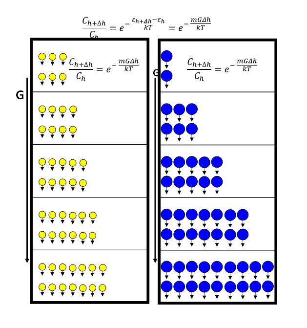
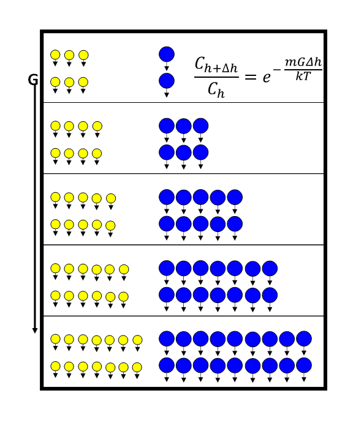
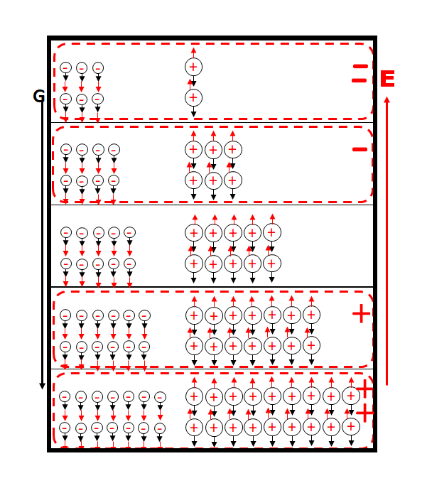
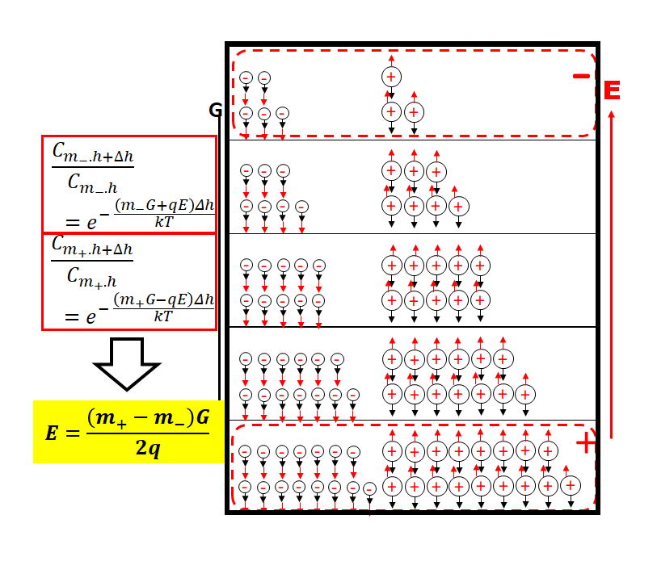
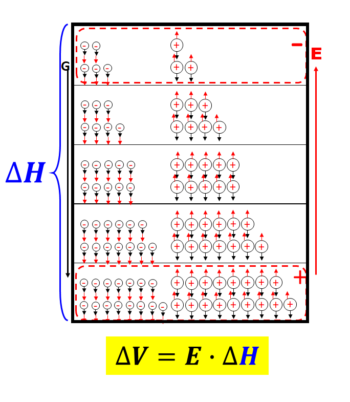
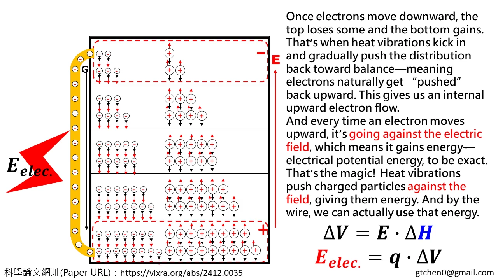

哈囉大家好，歡迎收看重力熱轉電影片！

在之前的影片裡，我們有提到一件蠻有趣的事，就是像重力或者離心力這樣的加速度力場，其實可以把「熱能」轉換成「電能」。今天這支影片要更仔細、更簡單地跟大家說明一下，這個過程到底是怎麼發生的。

我們先從一個大家都知道的現象開始講：在地球的重力作用下，輕的分子比較容易往高空飄，重的分子則比較容易往下沉。這個概念很簡單，就像熱氣球會上升，因為裡面的氣體比較輕。
我們來看圖。圖中黃色代表輕的分子，藍色是重的分子。為了讓大家看得清楚，我們不是畫那種混亂的分子分布，而是把每個高度的分子數量整齊地排出來，好讓大家比較上下差異。
你會發現，輕的分子在上下方的數量差不多，但重的分子就明顯上面少、下面多。這種濃度隨高度改變的情況
，其實可以用一個叫做「波茲曼方程式」的公式來描述，這個數學式圖裡也有。
重點是，這個式子可以告訴我們：質量不同的分子，在不同高度的分布會不一樣。

$$ \frac{C_{h+\Delta h}}{C_h} = e^{-\frac{mG\Delta h}{kT}} $$
$$ \frac{dC_h}{dh} = -\frac{mG C_h}{kT} $$

那如果我們把這些氣體混合起來，假設它們互不干擾，濃度還是會按照這個公式來變化。如果輕跟重的分子數量一樣多，最後的穩定狀態會變成上面輕的比較多、下面重的比較多。

接下來是重頭戲了！
我們來做一個概念上的替換
：把「輕的分子」換成「帶負電的離子」，把「重的分子」換成「帶正電的離子」。你覺得會發生什麼事？

如果這個空間裡沒有電場的話，會出現一個不平衡的情況：下面正離子比較多，整體就偏正電；上面負離子比較多，整體就偏負電。這樣一來，中間就會自己產生出一個往上的電場。

這個電場會把正離子往上推、把負離子往下拉，然後慢慢把原來的電場抵消掉。但有趣的是，這個電場永遠不會完全變成零。因為只要電場變弱了，重力又會讓重的正離子往下掉、輕的負離子往上跑，又會再次產生電場。所以，這個電場其實是可以自我維持的。

在這種穩定狀態下，離子的濃度分布會受到電場影響，所以我們可以用加了電場項的「波茲曼方程式」來描述它。為了讓中間區域維持電中性，正負離子的濃度變化趨勢會一樣。我們把兩個公式拿來聯立、整理一下，就可以推導出電場強度和離子質量差之間的關係。

$$ \frac{C_{m\_.h+\Delta h}}{C_{m\_.h}} = e^{-\frac{(m\_G + qE)\Delta h}{kT}} $$
$$ \frac{C_{m_{+}.h+\Delta h}}{C_{m_{+}.h}} = e^{-\frac{(m_{+}G - qE)\Delta h}{kT}} $$
$$ E = \frac{(m_{+} - m_{-})G}{2q} $$

重點來了！這個公式告訴我們，質量差越大，電場就越強，而且這跟離子的濃度完全沒有關係！這個結果其實跟 Tolman 在1910年做的實驗結果是一樣的——他當時也發現電場強度和濃度無關。
好，那現在我們知道空間中有個由下往上的電場，就會造成不同高度之間有一個電壓差。電壓就是電場乘上高度差嘛，這很直覺。

假設我們把負的粒子當成是電子，然後在上下之間接一條導線。那麼，上面的電子就可以沿著這條導線往下跑，在這個過程中，就產生了電能——也就是電壓乘上電荷。

$$ \Delta V = E \cdot \Delta H $$
$$ E_{\mathrm{elec.}} = q \cdot \Delta V $$

當電子跑到下面去之後，上面就少了電子，下面就多了
。這時候熱的震動又會開始把整個濃度重新拉回原本的平衡，也就是說，電子會自然地被熱振動「往上推回去」，這樣在內部就出現了一個由下往上的電子流。
而每當有電子往上移動，其實就是在逆著電場的方向走
，所以它會獲得電壓乘電荷的電位能。關鍵就在這裏，帶電粒子被熱振動推著往逆著電場的方向走而得到能量
。而這個電位能呢，我們就可以在導線裡面拿來用！
所以你看，我們等於是把「熱振動產生的熱能」轉換成了電位能。而且只要有重力場或離心力這種加速度力場，這個轉換就可以一直持續下去。
聽到這裡，是不是對「熱能怎麼變成電能」有了更清楚的認識呢？
如果你有任何問題，歡迎在影片下方留言，我會盡量為大家做進一步的說明！
(關鍵就在：帶電粒子被熱振動推著往逆著電場的方向走而得到能量。)
基於愛地球這個理由，為了加速全球技術發展，請將影片轉發出去！

影片網址：
重力對離子體作用下熱是如何轉為電的 https://youtu.be/JgQdZ7Nlv3I

Hello, everyone! Welcome to the Gravity-to-Electric Energy Movie!

In a previous video, we talked about something pretty fascinating—how forces like gravity or centrifugal force, which create acceleration, can actually turn heat energy into electric energy. And in today’s video, we’re diving deeper and breaking it down in a simpler way so it’s crystal clear how that works.

Let’s start with something we all kinda know: under Earth’s gravity, lighter molecules tend to float upward, while heavier ones sink downward. It’s just like how a hot air balloon rises—because the gas inside is lighter.

Now, take a look at this chart. The yellow dots show the light molecules, and the blue ones are the heavy ones. To make things easy to see, we’ve lined them up neatly by height, instead of showing a messy random spread.

You’ll notice that light molecules also change with height, but only slightly—while heavy molecules show a much bigger difference, with a lot more gathering at the bottom than at the top. This kind of pattern, where concentration changes with height, can actually be described using something called the Boltzmann equation—that formula you see right here in the diagram.

And here’s the key: the equation tells us that molecules with different masses spread out differently at different heights.

Now, if we mix these gases together and assume they don’t interact, the distribution still follows that formula. So, if we have equal numbers of light and heavy molecules, in the end, the lighter molecules will be more common than the heavier ones at higher altitudes, and the heavier molecules will outnumber the lighter ones down low.

Now comes the really exciting part!

Let’s play a little thought experiment: imagine we swap the light molecules for negatively charged ions, and the heavy ones for positively charged ions. What do you think would happen?

If there’s no electric field present, you’d get an imbalance: more positive ions at the bottom means the lower part becomes positively charged, and more negative ions at the top means the upper part becomes negatively charged. That imbalance naturally creates an upward electric field.

This field starts pushing positive ions upward and pulling negative ones downward, slowly canceling itself out. But here’s the wild part—it never totally disappears! Because as the field weakens, gravity pulls those heavy positive ions down again, and the light negative ones float back up, recreating the field. So this electric field can actually sustain itself!

In this steady state, the concentration of ions is affected by the field. And that’s where a modified version of the Boltzmann equation—one that includes the electric field—comes in handy. To keep things electrically neutral in the middle, the changes in positive and negative ion concentrations need to follow the same trend. By combining the equations and working through them, we can figure out how the electric field strength relates to the difference in ion masses.

Here comes the punchline! The equation tells us: the bigger the mass difference, the stronger the electric field. And amazingly, this doesn’t depend on the number of ions at all! That result actually matches what Tolman found way back in 1910—he noticed the same thing: field strength has nothing to do with ion concentration.

Now, knowing there’s an upward electric field in the space, we also get a voltage difference between different heights. (Since voltage is just electric field times height—super intuitive.)

If we assume the negative particles are electrons, and we connect a wire between the top and bottom! Electrons up top will flow down the wire, and that movement creates electric energy: voltage times charge.

Once electrons move downward, the top loses some and the bottom gains. That’s when heat vibrations kick in and gradually push the distribution back toward balance—meaning electrons naturally get “pushed” back upward. This gives us an internal upward electron flow.

And every time an electron moves upward, it’s going against the electric field, which means it gains energy—electrical potential energy, to be exact. That’s the magic! Heat vibrations push charged particles against the field, giving them energy. And by the wire, we can actually use that energy.

So in short—we’re turning the random jiggling of heat into usable electrical energy. And as long as we’ve got a gravitational or centrifugal field—basically, any kind of accelerating force—we can keep this energy conversion going.

Feeling like things finally clicked about how heat turns into electricity? If you’ve got any questions, feel free to drop a comment below—I’ll do my best to answer and explain more!

(Key: Heat vibrations push charged particles against the field, giving them energy.)

Video: How Heat Is Converted to Electricity under Gravitational Forces Acting on Ions https://youtu.be/3J8gOVRiWXo
